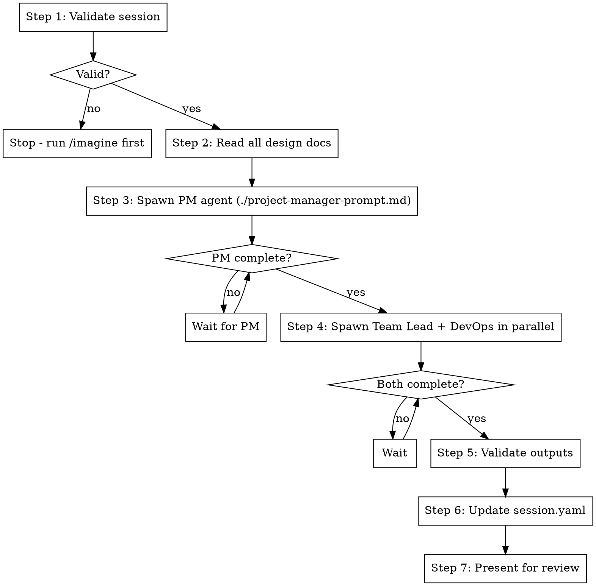

# /plan - Create Executable Implementation Plan

## Overview

The `/plan` skill takes design documents from `/imagine` and produces an executable implementation plan through automated agent collaboration.

**Announce at start:** "I'm using the /plan skill to create an implementation plan."

## Prerequisites

Requires completed `/imagine` session with:
- `docs/office/01-vision-brief.md`
- `docs/office/02-prd.md`
- `docs/office/03-market-analysis.md`
- `docs/office/04-system-design.md`
- `docs/office/session.yaml` with `status: imagine_complete`

## The Process



## Step-by-Step Execution

### Step 1: Validate Session
Read `docs/office/session.yaml`:
- If `status != imagine_complete`: Stop. Say "Run /imagine first to create design documents."
- If any design document missing: Stop. Say "Missing [document]. Run /imagine to complete design."
- If valid: Proceed to Step 2.

### Step 2: Read All Design Documents
Read all 4 documents and keep their content for the agent prompts:
- `docs/office/01-vision-brief.md`
- `docs/office/02-prd.md`
- `docs/office/03-market-analysis.md`
- `docs/office/04-system-design.md`

You will paste this content into the agent prompts (agents should NOT read files themselves).

### Step 3: Spawn Project Manager Agent
Dispatch the Project Manager using the template in `./project-manager-prompt.md`.

**CRITICAL:** Wait for this agent to complete and confirm plan.md was written before proceeding.

### Step 4: Spawn Team Lead + DevOps (Parallel)
**IMPORTANT:** Dispatch BOTH agents in a SINGLE message (parallel execution).

Use templates:
- `./team-lead-prompt.md`
- `./devops-prompt.md`

Wait for BOTH to complete before proceeding.

### Step 5: Validate Outputs
Verify all files were created:
```bash
ls docs/office/plan.md docs/office/tasks.yaml docs/office/05-implementation-spec.md
```

Validate YAML syntax:
```bash
python3 -c "import yaml; yaml.safe_load(open('docs/office/tasks.yaml')); print('Valid YAML')"
```

### Step 6: Update session.yaml
Update `docs/office/session.yaml`:
```yaml
status: plan_complete
current_phase: plan_complete
```

### Step 7: Present for Review
Show summary of created artifacts and say: "Plan complete! Review the artifacts, then /build when ready."

## Prompt Templates

- `./project-manager-prompt.md` - Creates plan.md
- `./team-lead-prompt.md` - Creates tasks.yaml and 05-implementation-spec.md
- `./devops-prompt.md` - Adds environment section to plan.md

## Red Flags

**NEVER:**
- Spawn all 3 agents at once (PM must complete first)
- Let agents read design docs themselves (paste content in prompt)
- Proceed if an agent returns without writing files
- Skip YAML validation

**If agent returns with 0 tool uses:**
- The prompt was not explicit enough
- Re-dispatch with clearer instructions to use Write tool
